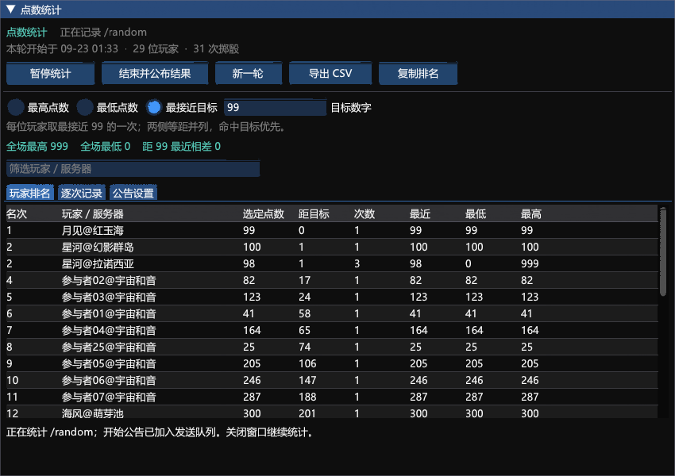
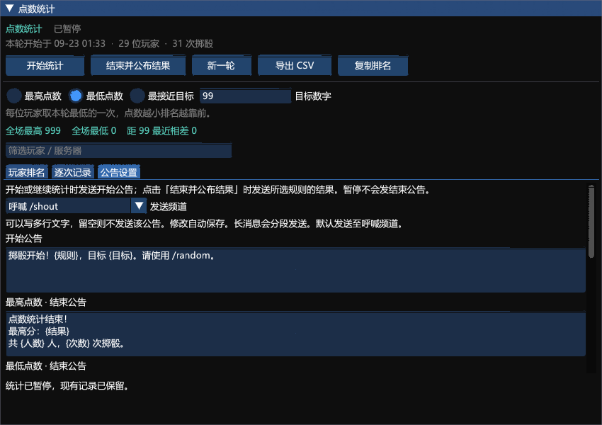

# 点数统计（DiceStats）

当前在线版本 **1.1.0.0**。作者：**断水剑**。Dalamud API 15 / .NET 10 / Windows x64。

从 RPgame 点数比拼拆出的独立统计插件，无需 RPgame 或 API Key。

## 在线安装

在卫月设置的「自定义插件仓库」添加以下地址，已添加者刷新插件列表：

```text
https://raw.githubusercontent.com/Alittlerecallinglittlebrother/DalamudCN-Plugins/main/repo.json
```

搜索 **点数统计** 并安装，输入 `/dstat` 打开。若之前加载了同名本地开发版，请先停用开发版，避免重复加载。保留原有 DiceStats 配置与记录。

[插件包](1.1.0.0/DiceStats.zip) · [对应源码和测试](1.1.0.0/DiceStats-source.zip) · [发布说明](1.1.0.0/RELEASE.md) · [SHA-256](1.1.0.0/SHA256SUMS.txt)

## 使用流程

1. 选择最高点数、最低点数或最接近目标。目标默认 99，可设为 0～999。
2. 点击「开始统计」，自动向呼喊 `/shout` 发送开始公告，接收本机实际收到的 `/random` 系统消息。
3. 点击「结束并公布结果」，停止统计并自动公布所选规则全部并列第一的玩家与点数。
4. 「公告设置」中可编辑开始、最高/最低/最近结束、无人参与五类文案，切换频道并预览。修改自动保存。
5. 结束后再开始，会自动归档旧轮次并启动空白一轮。暂停只暂停，不发结束公告。

同一玩家多次掷骰保留全部记录，排名选取最符合规则的一次；同名不同服务器分别统计。目标 99 时，98 与 100 等距并列，99 优先。并列全部公布，不随机淘汰。玩家手打的骰点文字不计入。

## 公告变量

可使用 `{规则}`、`{目标}`、`{结果}`、`{玩家}`、`{点数}`、`{差值}`、`{人数}`、`{次数}`、`{最高玩家}`、`{最高点数}`、`{最低玩家}`、`{最低点数}`。

例如：`恭喜 {结果} 获得本轮第一！`。`{结果}` 自动配对每名获胜玩家和点数，最近目标模式附差值。留空可关闭对应公告；多行和长文字会分段，每段间隔至少 3 秒。退出角色或卸载取消待发队列，重载不会重发旧公告。

支持逐次记录、筛选、复制排名、CSV 导出和本地自动保存。每轮最多 20,000 次，历史界面显示最近 500 条，导出包含全部。

## 验证情况

Release 构建 0 错误、0 警告；28 项核心测试及 74 项控制器、队列和原生 ImGui 检查通过。下图为虚构示例数据的离线原生界面绘制。**真实游戏内加载和公告收发尚未验证**；频道权限、发言限制和游戏过滤可能影响公告显示。




源码 ZIP、安装 ZIP 与已交付的 1.1.0.0 本地版本字节一致。源码包中的开发插件安装说明可用于本地调试，在线安装请按本页订阅步骤操作。
