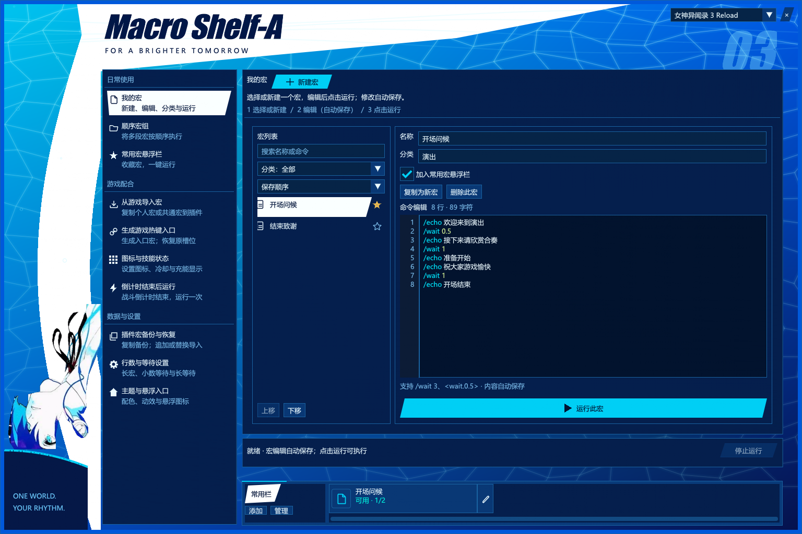
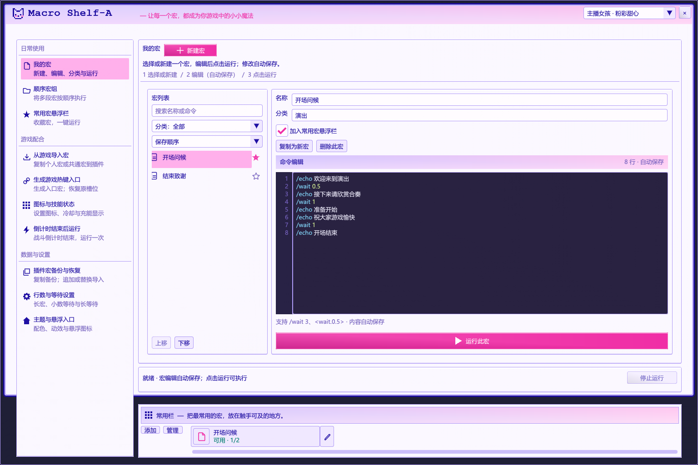
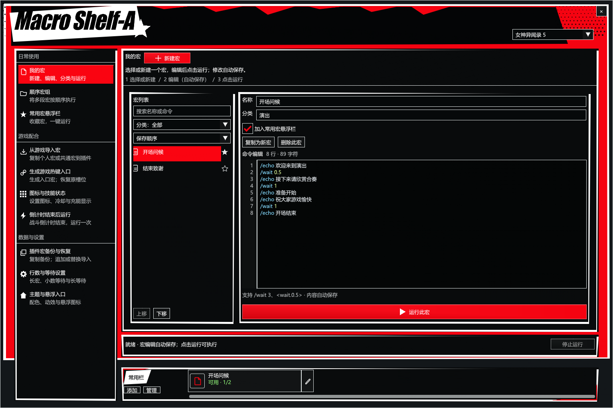

# Macro Shelf-A

当前在线版本：**0.9.4.0**。作者：**Akl**。DalamudCN API 15 / .NET 10。

插件简介：**当我受够了FF14那糟糕的宏指令**。

## 在线安装与更新

在 DalamudCN 的“自定义插件仓库”添加：

    https://raw.githubusercontent.com/Alittlerecallinglittlebrother/DalamudCN-Plugins/main/repo.json

保存后搜索 **Macro Shelf-A**；已添加者刷新插件安装器后更新。若启用了同名本地开发版，先停用以免重复加载。更新后用 /aklmacro version 确认实际版本 **0.9.4.0**。

[插件包](0.9.4.0/MacroShelfA.zip) · [对应源码与测试](0.9.4.0/MacroShelfA-source.zip) · [发布说明](0.9.4.0/RELEASE.md) · [SHA256](0.9.4.0/SHA256SUMS.txt)

## 第一次使用

1. /aklmacro 打开界面，在左侧选择 **我的宏**。
2. 点击 **新建宏**；已有游戏宏可在 **从游戏导入宏** 中预览并复制。
3. 选择宏，编辑名称、分类与命令；修改自动保存。
4. 点击 **运行此宏** 才启动。底部 **停止运行** 或 /aklmacro stop 可中止；选择、编辑和收藏不会运行宏。

## 所有功能直接列出

P3、主播女孩、P5 三主题共用以下十个独立页面，不再将功能藏进“更多 / 进阶”。经典界面的原资料库与编辑台仍保留为兼容回退。

| 页面 | 操作与结果 |
|---|---|
| 我的宏 | 新建、选择、搜索、分类、编辑、复制、删除确认、收藏与手动运行。 |
| 顺序宏组 | 新建组、添加与排序子宏；明确选择只运行此子宏或运行所属宏组。 |
| 常用宏悬浮栏 | 添加、运行、编辑或移出收藏，设置显示、锁定、列数与宽度；移出不删除宏。 |
| 从游戏导入宏 | 预览个人 / 共通各 100 槽，将选择的宏复制为插件内独立条目；不修改来源、不自动运行。 |
| 生成游戏热键入口 | 选择宏 / 组 / 子宏，预览槽位，备份并写入一行入口，或恢复原槽。生成后在游戏宏窗口手动拖到热键栏。 |
| 图标与技能状态 | 选择作用对象与普通 PvE 技能，预览图标、冷却和充能；明确保存或放弃。显示状态不代表整段宏一定可执行。 |
| 倒计时结束后运行 | 绑定宏或宏组，主动启用 / 停用；真实战斗倒计时完成时触发一次，忙碌时不排队。 |
| 插件宏备份与恢复 | 复制或粘贴 JSON，追加保留现有宏，替换需要确认；与游戏宏槽位恢复分开。 |
| 行数与等待设置 | 允许超过 15 行，设置小数或长等待，查看格式说明。 |
| 主题与悬浮入口 | 切换主题、装饰、减少动效、底部常用栏，以及主窗口关闭后的悬浮入口。 |

## 界面与兼容性

保留 P3 蓝青水光、主播女孩粉紫复古、P5 红黑白剪纸及原有动效。人物只做左侧小装饰。功能文字统一为原生常规字体，取消叠画加粗、人工斜体、按钮单独缩字。

修正末行选择错位、列表 / 常用栏裁切、滚动条遮挡及窄窗口可达性。三主题十页都有明确用途与操作说明，停止按钮保持固定；侧栏与正文按窗口尺寸滚动。

保留旧宏 ID、正文、顺序、收藏、长宏、完整显式等待、零默认额外间隔、数字切职顺序保护及倒计时逻辑。旧在线版配置升级至 **9**、交换格式 **5**，升级前生成备份；JSON 克隆 / 恢复创建新 ID 后需要重新生成关联游戏入口。

- /aklmacro：打开主界面
- /aklmacro bar：常用宏悬浮栏
- /aklmacro stop：停止运行
- /aklmacro version：查看实际加载版本
- /aklmacro trace on / trace status / trace off：可选动作诊断，默认关闭

## 实际控件离线预览

以下来自生产 C# / 原生 ImGui 离线宿主，**不是游戏截图或生图**；游戏状态与纹理由测试夹具代替。

### P3

### 主播女孩

### P5

## 验证与发行说明

**2702 项离线检查通过，Release 构建 0 警告、0 错误。实际游戏内字体、输入法、GPU 与原生交互尚待验收。** 本次不声称已解决全部历史动作 / 技能问题。

发行包复用已验证 DLL，只有外部安装清单 IconUrl 更换为本版本地址；图标、原画与源码 ZIP 保持原始字节。源码、版本查询及原构建验证文件中的“本地候选 / 未发布”是构建时状态，当前在线状态以索引和 [发布说明](0.9.4.0/RELEASE.md) 为准。

历史在线版本 [0.8.4.0](0.8.4.0/)、[0.8.2.0](0.8.2.0/)、[0.6.1.0](0.6.1.0/)、[0.5.0.0](0.5.0.0/) 与 [0.4.1.0](0.4.1.0/) 保留不变。
