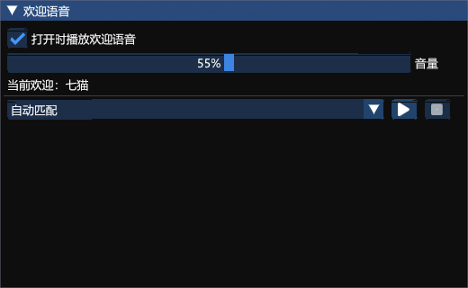
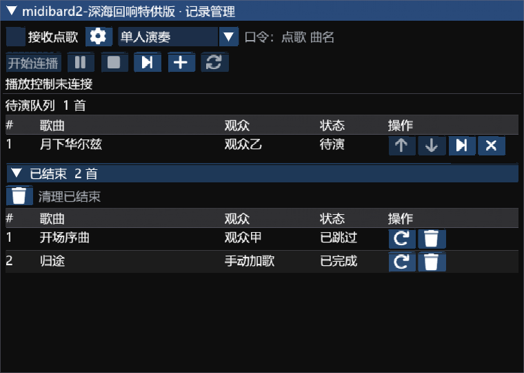
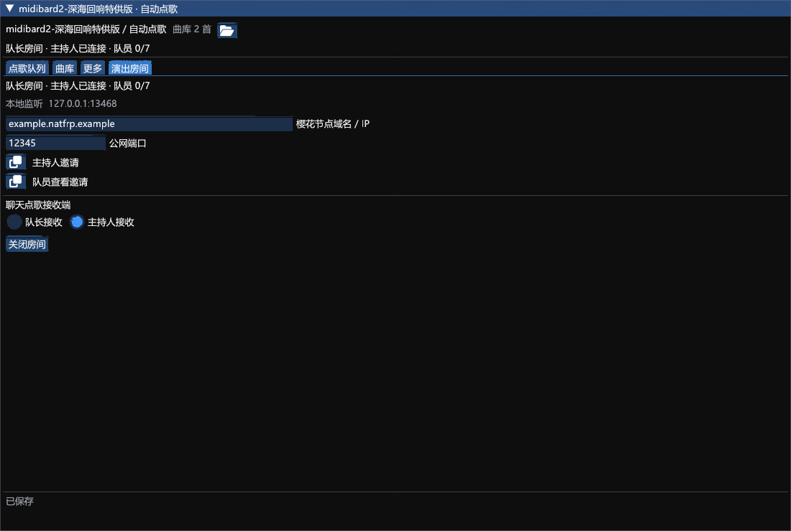

# midibard2-深海回响特供版

版本：3.2.5.11。作者：akira0245, Ori, Kalle, Zune, 断水剑。

基于 reckhou/MidiBard2 API 15 的深海回响定制分支，保留 MidiBard 演奏与合奏引擎，提供观众自动点歌、主持人协作和队员节目单查看。

- [安装包](3.2.5.11/MidiBard2.zip)
- [完整对应源码与构建脚本](3.2.5.11/MidiBard2-source.zip)
- [使用说明](3.2.5.11/STAGE-README.md)
- [欢迎语音](3.2.5.11/WELCOME-VOICE.md)
- [演出房间与队员查看](3.2.5.11/STAGE-ROOM.md)
- [验证范围](3.2.5.11/STAGE-VERIFICATION.md)
- [SHA256 校验](3.2.5.11/SHA256SUMS.txt)
- [GNU AGPL v3 许可](3.2.5.11/LICENSE)

## 安装

卫月自定义插件仓库地址：

```text
https://raw.githubusercontent.com/Alittlerecallinglittlebrother/DalamudCN-Plugins/main/repo.json
```

刷新安装器，搜索 `midibard2-深海回响特供版`，安装或更新到 `3.2.5.11`。本插件沿用 `MidiBard2` 内部标识和配置目录，安装前停用原版及旧版开发插件，并备份配置。

打开底部“自动点歌”，选择单人或合奏主控，进入乐器演奏模式后点击“开始连播”。观众在开启的频道发送 `点歌 曲名`，唯一匹配直接排队；没有匹配或有多个版本时才需要选择歌曲。合奏需各端事先配置好曲目、轨道、乐器和合奏监听。

## 主持人和队员

队长在“自动点歌 → 演出房间”创建房间，填写樱花 TCP 隧道的公网节点与端口，分别复制“主持人邀请”和“队员查看邀请”。所有角色沿用同一条隧道，只有队长电脑需要运行樱花启动器。

主持人无需加入游戏小队，在房间选择“主持人”并加入后，可加歌、排序、删除、指定下一首和控制连播；队长保留同等权限，实际演奏始终由队长端执行。

普通乐手选择“队员查看”，粘贴独立查看邀请，即可查看当前曲目、下一首和待演顺序。最多七名同时在线，不占主持人名额。查看端不接收点歌、不能修改队列，也不会启动本机自动连播；原 MidiBard 合奏配置和跟随照常使用。队长、主持人和队员建议统一更新至本版。

## 删除与导出

已结束队列和节目单每行可用垃圾桶删除，并支持清理已结束节目。点歌记录支持逐条删除、按当前筛选清理已处理记录；演出记录支持删除单条明细、清理本场已结束明细和删除整场。所有删除操作需要确认，曲库和 MIDI 文件保留；正在准备或演奏的节目不能删除。主持人也可同步清理队列历史。

未归档场次可以直接导出：点击导出按钮，选择 JSON 或 CSV，文件保存到 `%APPDATA%/XIVLauncherCN/pluginConfigs/MidiBard2/Stage/Exports`，旁边文件夹按钮可打开结果。每次导出独立保存，不会结束正在进行的演出。

## 欢迎语音与加载修复

首次打开插件窗口时，`七猫猫猫猫@伊修加德` 和 `悼亡录@红茶川` 播放各自专属欢迎，其他角色播放通用欢迎。使用提供的三段原始 WAV，每次登录仅自动播放一次；演奏或准备期间跳过，播放中开始演奏会停止。设置窗口的“欢迎语音”页可关闭、调节独立音量、试听和停止，声音仅在本机播放。

3.2.5.11 修复本地 3.2.5.10 的加载失败：卫月从内存加载 DLL 时程序集路径为空，欢迎模块现改用卫月提供的插件文件路径。欢迎模块初始化异常只禁用欢迎功能，不再阻止整个插件启动。

232 项核心测试、188 条常规运行检查 PASS 输出，以及 5 条实际 DLL 内存加载检查通过，包含原音频通过 Windows 输出完整播放。游戏内加载、欢迎触发、实际演奏、多人合奏及樱花公网连通性尚未验收。压缩包沿用已验证的本地构建，包内文档记录发布前状态；在线安装以本页为准。







## 来源与许可

上游：[reckhou/MidiBard2](https://github.com/reckhou/MidiBard2)，基准提交 `d8d1bd4454604cc837affd593fc3b982f33433e7`。原 MidiBard 代码由 akira0245 编写并最初用于 MidiBard 项目，保留 Ori、Kalle、Zune 及其他贡献者署名。此修改版按 GNU AGPL v3 或后续版本提供，并随每个版本提供完整对应源码。
