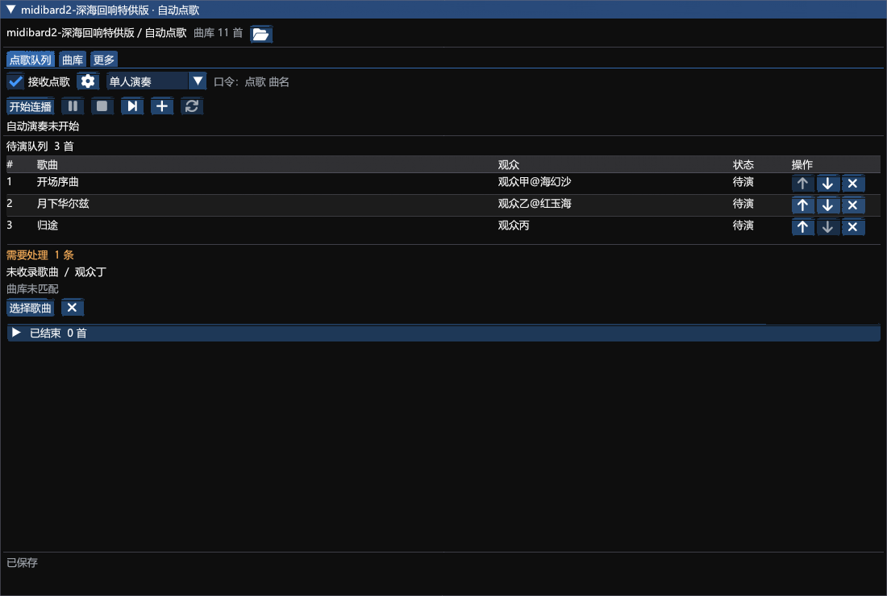

# midibard2-深海回响特供版

版本：3.2.5.5。作者：akira0245, Ori, Kalle, Zune, 断水剑。

基于 reckhou/MidiBard2 API 15 的深海回响定制分支，保留 MidiBard 演奏与合奏引擎，并增加自动点歌队列。

- [安装包](3.2.5.5/MidiBard2.zip)
- [完整对应源码与构建脚本](3.2.5.5/MidiBard2-source.zip)
- [使用说明](3.2.5.5/STAGE-README.md)
- [验证范围](3.2.5.5/STAGE-VERIFICATION.md)
- [SHA256 校验](3.2.5.5/SHA256SUMS.txt)
- [GNU AGPL v3 许可](3.2.5.5/LICENSE)

## 安装

卫月自定义插件仓库地址：

```text
https://raw.githubusercontent.com/Alittlerecallinglittlebrother/DalamudCN-Plugins/main/repo.json
```

刷新安装器，搜索 `midibard2-深海回响特供版`。本插件沿用 `MidiBard2` 内部标识和配置目录，安装前停用原版及旧版开发插件，并备份配置。

打开底部“自动点歌”，选择单人或合奏主控，进入乐器演奏模式后点击“开始连播”。观众在开启的频道发送 `点歌 曲名`，唯一匹配直接排队；没有匹配或有多个版本时才需要选择歌曲。合奏需各端事先配置好曲目、轨道、乐器和合奏监听。

193 项核心测试和 95 条原生运行检查输出通过。游戏内实际乐器演奏与多人合奏尚未验收。



## 来源与许可

上游：[reckhou/MidiBard2](https://github.com/reckhou/MidiBard2)，基准提交 `d8d1bd4454604cc837affd593fc3b982f33433e7`。原 MidiBard 代码由 akira0245 编写并最初用于 MidiBard 项目，保留 Ori、Kalle、Zune 及其他贡献者署名。此修改版按 GNU AGPL v3 或后续版本提供，并随每个版本提供完整对应源码。
