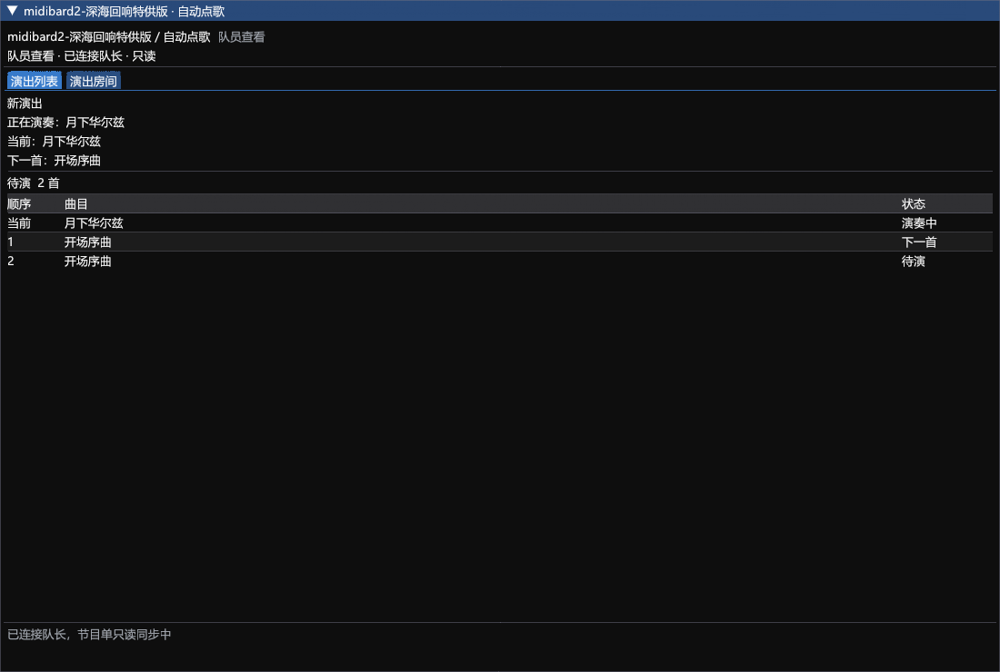
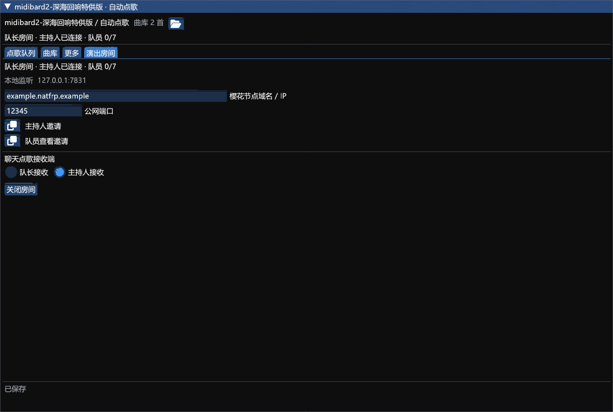

# midibard2-深海回响特供版

版本：3.2.5.8。作者：akira0245, Ori, Kalle, Zune, 断水剑。

基于 reckhou/MidiBard2 API 15 的深海回响定制分支，保留 MidiBard 演奏与合奏引擎，提供观众自动点歌、主持人协作和队员节目单查看。

- [安装包](3.2.5.8/MidiBard2.zip)
- [完整对应源码与构建脚本](3.2.5.8/MidiBard2-source.zip)
- [使用说明](3.2.5.8/STAGE-README.md)
- [演出房间与队员查看](3.2.5.8/STAGE-ROOM.md)
- [验证范围](3.2.5.8/STAGE-VERIFICATION.md)
- [SHA256 校验](3.2.5.8/SHA256SUMS.txt)
- [GNU AGPL v3 许可](3.2.5.8/LICENSE)

## 安装

卫月自定义插件仓库地址：

```text
https://raw.githubusercontent.com/Alittlerecallinglittlebrother/DalamudCN-Plugins/main/repo.json
```

刷新安装器，搜索 `midibard2-深海回响特供版`，安装或更新到 `3.2.5.8`。本插件沿用 `MidiBard2` 内部标识和配置目录，安装前停用原版及旧版开发插件，并备份配置。

打开底部“自动点歌”，选择单人或合奏主控，进入乐器演奏模式后点击“开始连播”。观众在开启的频道发送 `点歌 曲名`，唯一匹配直接排队；没有匹配或有多个版本时才需要选择歌曲。合奏需各端事先配置好曲目、轨道、乐器和合奏监听。

## 主持人和队员

队长在“自动点歌 → 演出房间”创建房间，填写樱花 TCP 隧道的公网节点与端口，分别复制“主持人邀请”和“队员查看邀请”。所有角色沿用同一条隧道，只有队长电脑需要运行樱花启动器。

主持人无需加入游戏小队，在房间选择“主持人”并加入后，可加歌、排序、删除、指定下一首和控制连播；队长保留同等权限，实际演奏始终由队长端执行。

普通乐手选择“队员查看”，粘贴独立查看邀请，即可查看当前曲目、下一首和待演顺序。最多七名同时在线，不占主持人名额。查看端不接收点歌、不能修改队列，也不会启动本机自动连播；原 MidiBard 合奏配置和跟随照常使用。队长、主持人和队员建议统一更新至本版。

207 项核心测试及 158 条运行检查 PASS 输出通过，包含真实本机 TLS、多客户端和独立进程检查。游戏内实际演奏、多人合奏及樱花公网连通性尚未验收。





## 来源与许可

上游：[reckhou/MidiBard2](https://github.com/reckhou/MidiBard2)，基准提交 `d8d1bd4454604cc837affd593fc3b982f33433e7`。原 MidiBard 代码由 akira0245 编写并最初用于 MidiBard 项目，保留 Ori、Kalle、Zune 及其他贡献者署名。此修改版按 GNU AGPL v3 或后续版本提供，并随每个版本提供完整对应源码。
